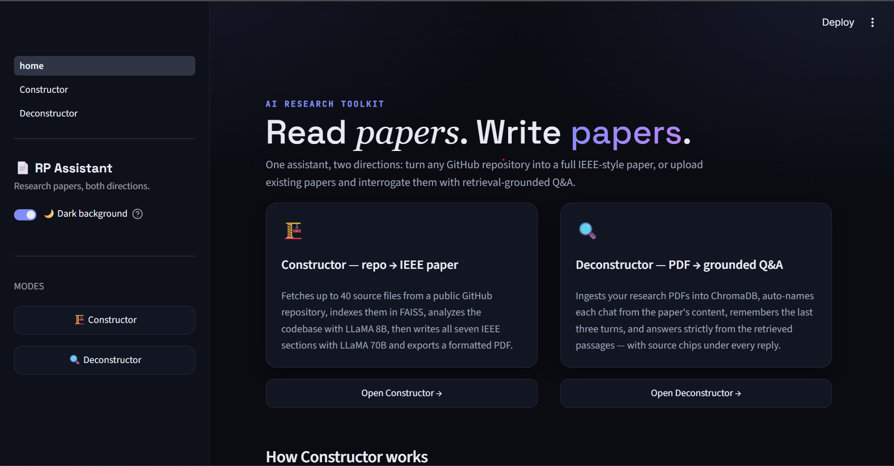
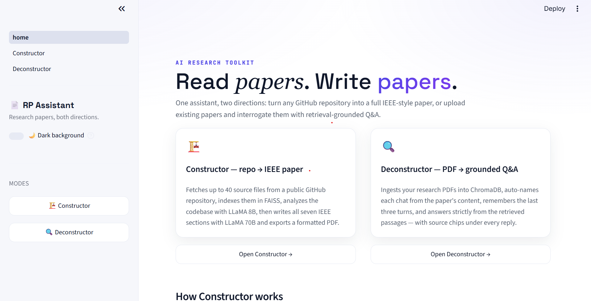
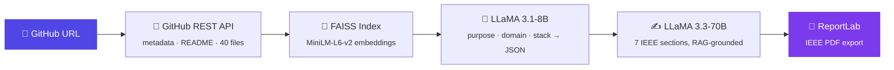
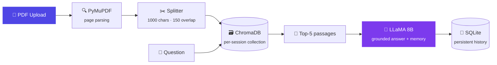

<div align="center">


# 📄 Research Paper AI Assistant

**An AI platform that works in both directions** — 🏗️ *generates* full IEEE research papers from GitHub repositories, and 🔍 *deconstructs* existing papers into grounded, source-cited Q&A.

<br>


<br>

[✨ Features](#-features) · [🎬 Demo](#-demo) · [🧠 How it works](#-how-it-works) · [⚡ Quick start](#-quick-start) · [🛠️ Tech stack](#%EF%B8%8F-tech-stack) · [🗺️ Roadmap](#%EF%B8%8F-roadmap)

</div>

---

## 🎯 Two modes, one assistant

<table>
<tr>
<td width="50%" valign="top">

### 🏗️ Constructor
**GitHub repo → IEEE paper**

Paste any public repository URL and watch the pipeline run live:

`Fetching → Indexing → Analyzing → Generating`

Up to **40 source files** are pulled via the GitHub API, embedded into **FAISS**, analyzed by **LLaMA 8B**, then **LLaMA 70B** writes all **7 IEEE sections** — exported as a formatted PDF in one click.

</td>
<td width="50%" valign="top">

### 🔍 Deconstructor
**Research PDF → grounded Q&A**

Upload papers, ask anything. Every answer is retrieved from the document itself:

`PDF → chunks → ChromaDB → top-5 → answer`

Sessions are **auto-named from the paper's content**, remember the **last 3 turns**, persist across restarts in **SQLite**, and show **source chips** under every reply — no hallucinated citations.

</td>
</tr>
</table>

<div align="center">

| 📑 7 | 📂 40 | 🎯 top-5 | 🧠 3 | 🌗 2 |
|:---:|:---:|:---:|:---:|:---:|
| IEEE sections generated | repo files indexed | RAG passages per answer | conversation turns remembered | themes — black & white |

</div>

---

## ✨ Features

- 🌗 **Dark / light theme toggle** — Streamlit has no runtime theming, so this app ships its own engine: theme state in `session_state`, injected CSS design-tokens, near-black `#0A0C12` ↔ pure white
- 📡 **Live pipeline pills** — watch each Constructor stage light up: `✓ Fetching → ● Indexing → …`
- 🏷️ **Auto-named chats** — LLaMA titles each session from the paper itself (*"Transformer Attention Mechanism"*, not *"Chat 1"*)
- 📎 **Source attribution chips** — every answer shows exactly which PDFs it came from
- 🗂️ **Section tabs before download** — preview Abstract → References, then export the IEEE PDF
- 📊 **GitHub rate-limit monitor** — remaining API calls + reset time, right in the sidebar
- ⚡ **Snappy navigation** — heavy libraries import lazily, API calls are cached, and the embedding model warms up once per server
- 🔁 **Zero re-ingestion** — PDFs are embedded once per session, survive Streamlit reruns
- 🩹 **Self-healing database** — automatic schema migration on every startup, no data loss

---

## 🎬 Demo

<div align="center">

| 🌙 Dark mode | ☀️ Light mode |
|:---:|:---:|
|  |  |

<sub>*(drop your screenshots into `docs/` — `screenshot-dark.png` & `screenshot-light.png`)*</sub>

</div>

---

## 🧠 How it works

### Constructor pipeline



### Deconstructor pipeline



---

## ⚡ Quick start

```bash
# 1 · Clone
git clone https://github.com/Abhishek10946/research-paper-assistant.git
cd research-paper-assistant

# 2 · Virtual environment
python -m venv venv
source venv/bin/activate        # Windows: venv\Scripts\activate

# 3 · Install
pip install -r requirements.txt

# 4 · Configure
cp .env.example .env            # add your GROQ_API_KEY

# 5 · Launch 🚀
streamlit run home.py
```

Open **http://localhost:8501** — flip the 🌙 toggle, paste a repo, go.

<details>
<summary><b>🔑 Where to get API keys</b></summary>
<br>

| Key | Source | Required |
|---|---|:---:|
| `GROQ_API_KEY` | [console.groq.com](https://console.groq.com) — free tier | ✅ |
| `GITHUB_TOKEN` | [github.com/settings/tokens](https://github.com/settings/tokens) — raises rate limit **60 → 5000 req/hr** | ⭐ recommended |
| `LANGCHAIN_API_KEY` | [smith.langchain.com](https://smith.langchain.com) — tracing | optional |

</details>

---

## 🛠️ Tech stack

| Layer | Technology | Why |
|---|---|---|
| 🖥️ **UI** | Streamlit + custom CSS token engine | Runtime black/white theming Streamlit doesn't offer natively |
| 🧠 **LLMs** | Groq — LLaMA 3.3-70B ✍️ · LLaMA 3.1-8B ⚡ | 70B for prose quality, 8B for fast analysis & Q&A |
| 🔗 **Orchestration** | LangChain 0.3 | Loaders, splitters, vector-store glue |
| 🔢 **Embeddings** | `all-MiniLM-L6-v2` (384-dim, normalized) | Small, fast, CPU-friendly |
| 🧩 **Vector search** | FAISS (Constructor) · ChromaDB (Deconstructor) | In-memory speed vs. persistent per-session collections |
| 📄 **PDF** | ReportLab (write) · PyMuPDF (read) | IEEE-styled export · reliable text extraction |
| 💾 **Persistence** | SQLite + SQLAlchemy ORM | Sessions & messages with auto-migration |

<details>
<summary><b>📁 Project structure</b></summary>

```
research-paper-assistant/
├── home.py                      # Landing — hero, mode cards, workflow
├── requirements.txt
├── .env.example                 # → rename to .env, add keys
├── .streamlit/config.toml       # Base dark theme (no load flicker)
│
├── pages/
│   ├── Constructor.py           # Repo → paper UI (pipeline pills, tabs, PDF)
│   └── Deconstructor.py         # PDF chat UI (sessions, chips, memory)
│
├── constructor/
│   ├── github_loader.py         # REST API — tree, files, rate limit
│   ├── vectorstore.py           # FAISS index builder
│   ├── analysis.py              # LLaMA 8B → structured JSON
│   ├── paper_generator.py       # LLaMA 70B × 7 sections
│   └── pdf_builder.py           # ReportLab IEEE export
│
├── deconstructor/
│   ├── ingestion.py             # PyMuPDF → splitter → ChromaDB
│   ├── retriever.py             # top-5 similarity search
│   ├── memory.py                # last-3-turns context
│   ├── llm.py                   # grounded ask() + name_session()
│   └── database.py              # SQLAlchemy ORM + auto-migration
│
├── shared/
│   ├── ui.py                    # ★ theme engine + components
│   ├── config.py · llm.py · embeddings.py · text_splitter.py
│
└── data/                        # runtime — chroma/ · faiss_cache/ · sessions.db
```

</details>

<details>
<summary><b>🩺 Troubleshooting</b></summary>
<br>

**`GitHub API rate limit exceeded`** → add `GITHUB_TOKEN` to `.env` (60 → 5000 req/hr) or wait for the reset time shown in the sidebar.

**`no such column: sessions.last_active`** → just restart; `_migrate()` in `database.py` adds the column automatically without touching data.

**Slow first load (4–10 s)** → the ~90 MB MiniLM model downloads once, then `@st.cache_resource` makes every later start instant.

**PDF not processing** → the file must contain selectable text (scanned images won't work); keep files under 50 MB.

</details>

---

## 🗺️ Roadmap

- [x] IEEE paper generation from any public repo
- [x] RAG-grounded PDF Q&A with source chips
- [x] 🌗 Runtime dark/light theme engine
- [x] Auto-named, persistent, deletable chat sessions
- [x] Automatic DB migration on startup
- [ ] 🐳 Docker image + `docker-compose.yml`
- [ ] ☁️ One-click Streamlit Cloud deploy
- [ ] 🔐 Private repos via OAuth
- [ ] 📚 APA / MLA / ACM formats
- [ ] 🕸️ Citation graph generation
- [ ] 🆚 Multi-paper comparative analysis

---

## 👨‍💻 Author

<div align="center">

**Abhishek Kale**
B.Tech Electrical Engineering · COEP Technological University, Pune

[](https://github.com/Abhishek10946)
[](https://www.linkedin.com/in/abhishek-kale-889437205)

</div>

---

<div align="center">

### ⭐ If this project helped you, a star means a lot!

<sub>📜 Educational & research use · respect the licenses of input repositories and the Groq / LangChain terms of service</sub>

<br><br>


</div>
